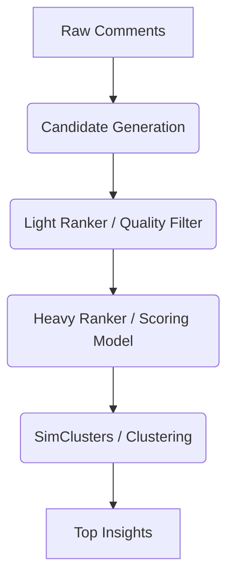

# X-Algorithm 기반 댓글 분석 고도화 전략 (Integration Strategy)

## 1. 개요 (Overview)
사용자는 X(구 Twitter)의 추천 알고리즘(X-Algorithm)을 분석하여 현재 파이프라인(`pipeline_service.py`)의 댓글 분석 로직에 적용하고자 합니다.
현재 로그상 **"입력 0건"** 문제는 데이터 수집 파이프라인의 **치명적인 버그**로 판명되었으며, 이를 우선 수정해야 X-Algorithm을 적용할 수 있습니다.

---

## 2. 긴급 수정 사항: 데이터 파이프라인 버그 (Critical Fix)

### 2.1 문제 원인 (`YoutubeClient` vs `PipelineService` 불일치)
- **`PipelineService.py`**: 비디오 객체 내부의 `comments` 필드를 순회하며 데이터를 수집하려고 시도합니다.
  ```python
  for v in youtube_data["videos"]:
      for c in v.get("comments", []): # <--- 여기서 빈 리스트 반환
  ```
- **`YoutubeClient.py`**: 비디오 객체(`collected_videos`) 생성 시 **`comments` 리스트를 포함하지 않고** 단순히 개수(`comments_count`)만 저장합니다.
  ```python
  collected_videos.append({
      "video_id": v["id"],
      ...
      "comments_count": len(comments) # <--- 리스트 누락됨
  })
  ```

### 2.2 해결 방안
`YoutubeClient.collect_video_data` 메서드에서 `collected_videos` 딕셔너리에 `"comments": comments` 필드를 명시적으로 추가해야 합니다.

---

## 3. X-Algorithm 적용 아키텍처 (Proposed Architecture)

X(Twitter)의 추천 시스템 구조(Candidate Generation -> Light Ranker -> Heavy Ranker)를 댓글 분석에 맞게 경량화하여 적용합니다.

### 3.1 전체 파이프라인 구조


### 3.2 단계별 상세 로직

#### Step 1: Candidate Generation (후보군 생성)
- **현재**: 수집된 모든 댓글.
- **개선**: `In-Network`(제품명 직접 언급) vs `Out-of-Network`(관련 키워드, 잠재 니즈)로 분류하여 소싱.

#### Step 2: Light Ranker (경량 필터링)
- **목적**: 스팸, 무의미한 단답형 댓글을 빠르게 제거 (CPU bound).
- **적용 로직**:
    - **Visibility Filtering**: 차단 단어, 광고 계정 필터링.
    - **Quality Score**: 길이(Length) < 5 제거, 한글 비율 < 50% 제거.
- **구현 위치**: `QualityFilter` 클래스 강화.

#### Step 3: Heavy Ranker (정밀 스코어링)
- **목적**: 진짜 비즈니스 인사이트가 될 만한 댓글에 높은 점수 부여.
- **Scoring Model**: $Score = w_1 \cdot P(Engagement) + w_2 \cdot P(Relevance) + w_3 \cdot P(Sentiment)$
    - $P(Engagement)$: 좋아요 수 / (대댓글 수 + 1) 정규화.
    - $P(Relevance)$: 제품명/핵심 키워드 포함 여부 (가중치 2.0).
    - $P(Sentiment)$: 감정 분석(절댓값이 클수록 좋음, 강한 긍정/부정).

#### Step 4: SimClusters (유사도 클러스터링)
- **목적**: "너무 비싸요", "가격이 부담돼요" 같은 중복된 페인포인트를 하나로 묶음.
- **로직**:
    1. 댓글을 임베딩(Embedding) 하거나 간단한 TF-IDF 벡터화.
    2. 코사인 유사도 0.7 이상인 댓글들을 클러스터링.
    3. 클러스터 내에서 Score가 가장 높은 댓글을 **Representative(대표)**로 선정.

---

## 4. 구현 로드맵
1.  **Phase 1 (Fix)**: `youtube_client.py` 수정 후 데이터 수집 정상화 확인 (`0건` -> `N건`).
2.  **Phase 2 (Light Ranker)**: `CommentAnalysisService`에 필터링 로직 강화.
3.  **Phase 3 (Heavy Ranker)**: X-Algorithm 스타일의 점수 산정 함수(`calculate_score`) 구현.

이 전략은 `RULES.md`에 의거하여 코드를 직접 수정하지 않고, 사용자 승인 후 적용 가능한 상세 설계 문서입니다.
