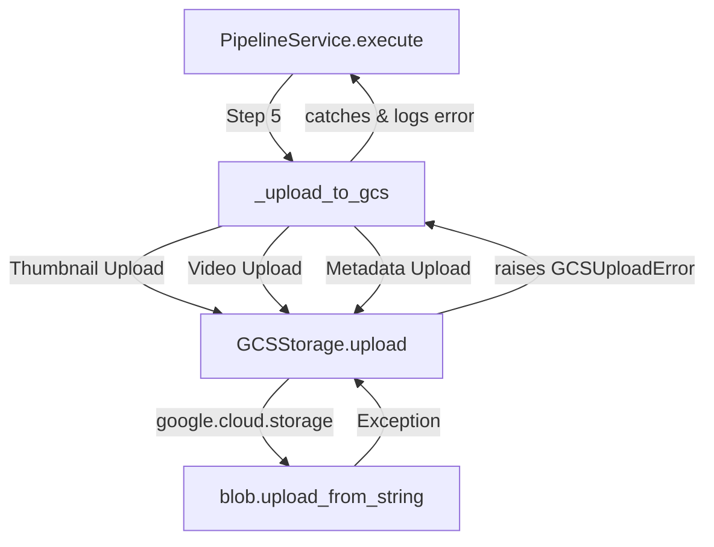

# MediaFileStorageError 분석 보고서

## 1. 개요 및 정의
**MediaFileStorageError**는 `PipelineService`가 생성된 미디어 콘텐츠(썸네일, 비디오, 메타데이터)를 Google Cloud Storage(GCS)로 이관하는 과정에서 발생하는 `GCSUploadError` 및 관련 `StorageError`를 의미합니다.

이 에러는 주로 파이프라인의 **Step 5: 업로드** 단계에서 발생하며, 서비스 중단(Crash)보다는 **데이터 영속성 실패(Data Persistence Failure)**로 이어집니다.

## 2. 코드 레벨 발생 경로 (Call Stack)

에러는 다음 호출 흐름에서 발생합니다:

### 주요 파일 및 함수

1.  **`src/genesis_ai/infrastructure/storage/gcs_storage.py`**:
    *   **메서드**: `upload(data, path, content_type)`
    *   **로직**: `google-cloud-storage` 라이브러리를 사용하여 데이터 업로드 시도. 실패 시 `GCSUploadError` 발생시킴.
    *   **원인**: 권한 없음(`Forbidden`), 버킷 없음(`NotFound`), 네트워크 타임아웃.

2.  **`src/genesis_ai/services/pipeline_service.py`**:
    *   **메서드**: `_upload_to_gcs(product, config, ...)`
    *   **로직**: 썸네일, 비디오, 메타데이터를 순차적으로 업로드. 개별 `try-except` 블록으로 감싸져 있어 하나가 실패해도 나머지는 시도함.
    *   **이슈**: 에러를 `logger.error`로 남기지만, 파이프라인 전체 결과(`PipelineResult`)에는 '성공'으로 기록될 수 있어, 사용자는 업로드 실패를 즉시 인지하기 어려움.

## 3. 에러 재현 (Reproduction Steps)

### 시나리오 1: 로컬 개발 환경 인증 누락
1.  `key.json` 파일을 제거하거나 이름을 변경합니다.
2.  파이프라인 실행 시 `config.upload_to_gcs = True` 설정.
3.  **결과**: `google.auth.exceptions.DefaultCredentialsError` 발생 -> `GCSUploadError`로 래핑됨.

### 시나리오 2: 동적 버킷 생성 실패 (권한 문제)
1.  GCS 생성 권한(`storage.buckets.create`)이 없는 Service Account 사용.
2.  `.env`에 `GCS_BUCKET_NAME`을 비워둠 (자동 생성 로직 트리거).
3.  **결과**: `gcs_storage.py`의 `ensure_bucket`에서 `Forbidden` 발생.

### 시나리오 3: 잘못된 경로/파일명
1.  `product['name']`에 파일 시스템이나 URL로 사용할 수 없는 특수문자(예: `/`, `\`)가 포함된 경우.
2.  `build_gcs_prefix` 유틸리티가 이를 처리하지 못하면 잘못된 object path 생성.
3.  **결과**: 400 Bad Request 또는 경로 오류 발생.

## 4. 해결 방안 (Mitigation)

### 단기 조치 (Hotfix)
*   **환경 변수 확인**: `.env`에 `GCS_BUCKET_NAME`이 명시되어 있는지 확인.
*   **키 파일 확인**: `key.json`이 존재하고 `GOOGLE_APPLICATION_CREDENTIALS`가 이를 가리키는지 확인.

### 장기 개선 (Refactoring)
1.  **Fail-Fast 적용**: `PipelineService.execute` 초기에 `storage.health_check()`를 호출하여 업로드 불가능 상태면 조기에 경고.
2.  **결과 상태 세분화**: `PipelineResult`에 `upload_status` 필드를 추가하여 UI에서 "생성 성공했으나 업로드 실패" 상태를 표시.
3.  **파일명 정규화**: `_upload_to_gcs` 진입 전 `product['name']`을 slugify 처리하여 안전한 경로 보장.
