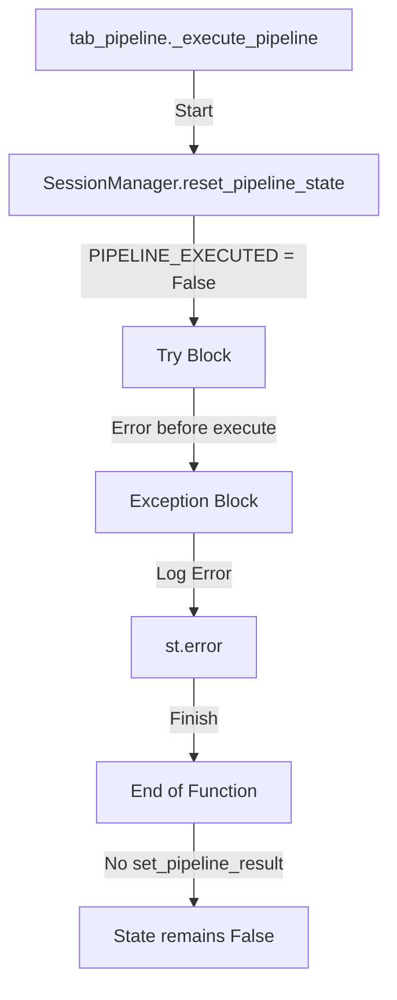

# SessionManager 파이프라인 완료 플래그 버그 분석 보고서

## 1. 개요 및 정의
**Session Completion Bug**는 파이프라인 실행 중 치명적인 오류(Critical Exception)가 발생하거나 실행이 완료된 직후, `SessionManager.PIPELINE_EXECUTED` 상태 플래그가 올바르게 갱신되지 않거나 UI 상태와 동기화되지 않는 현상을 말합니다.

이로 인해 사용자는 다음과 같은 경험을 할 수 있습니다:
1.  **로그 소실**: 실행 중 에러가 발생했으나, 다른 탭을 다녀오면 에러 로그와 상태가 사라짐.
2.  **무한 대기 오해**: 실행 완료 후 UI가 즉시 리프레시되지 않아(버튼 클릭 스코프 내 잔존), 사용자가 여전히 '실행 중'으로 오해.

## 2. 코드 레벨 발생 경로 (Call Stack)

### 시나리오 1: Critical Exception 발생 시 상태 미갱신

*   **`src/genesis_ai/presentation/tabs/tab_pipeline.py`**:
    *   `_execute_pipeline` 함수 내 `try...except` 블록에서 예외 발생 시(Line 201), 에러 로그만 남기고 `SessionManager.set_pipeline_result()`를 호출하지 않음.
    *   결과적으로 `PIPELINE_EXECUTED`가 `False`로 남음.
    *   `st.button` 스코프가 끝나면(다른 인터랙션 시) 로그와 에러 메시지가 화면에서 사라짐.

### 시나리오 2: 성공 후 UI 리프레시 부재

*   파이프라인 성공 시(Line 146) `render_pipeline_results`를 호출하여 **현재 프레임**에 결과를 그 림.
*   하지만 `st.rerun()`을 호출하지 않아, 사용자는 여전히 "버튼이 눌린 상태(Button Action Scope)" 안에 머묾.
*   이 상태에서는 다른 위젯 조작 시 예측 불가능한 UI 리셋이 발생할 수 있음.

## 3. 에러 재현 (Reproduction Steps)

### 재현 1: 초기화단계 강제 에러
1.  `_execute_pipeline`의 `get_services()` 호출 직전 `raise ValueError("Simulated Crash")` 코드 삽입.
2.  "파이프라인 실행" 버튼 클릭.
3.  화면에 "치명적 오류" 표시됨.
4.  사이드바에서 다른 탭으로 이동했다가 다시 복귀.
5.  **결과**: 실행했던 오류 로그와 메시지가 모두 사라지고 초기 상태로 리셋됨 (`PIPELINE_EXECUTED`가 False라서).

## 4. 해결 방안 (Mitigation)

### 단기 조치 (Finally Block)
*   `_execute_pipeline`의 `try...except` 구문에 `finally` 블록을 추가하지 말고, **`except` 블록 내에서도 상태를 갱신**하도록 수정.
*   실패 상태(`PipelineResult(success=False, ...)`)를 생성하여 `set_pipeline_result`를 호출, 최소한 "실패했음"을 세션에 남겨야 함.

### 장기 개선 (Explicit Rerun)
1.  **Force Rerun**: 실행 완료(성공/실패) 후 `st.rerun()`을 호출하여 버튼 스코프를 탈출하고, `elif SessionManager.get(PIPELINE_EXECUTED):` 블록에서 결과가 렌더링되도록 흐름 변경.
2.  **Persistent Logs**: 파이프라인 로그를 `PipelineResult` 객체나 별도 세션 키에 영구 보관하여 리프레시 후에도 유지.
