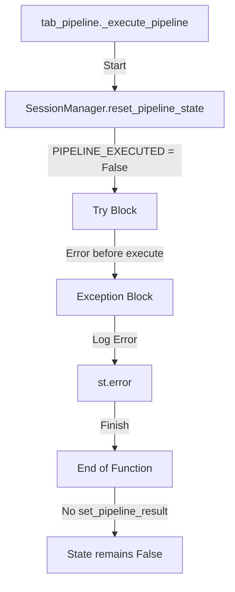

# Session Completion Bug 수정 계획

## 1. 개요 및 정의

**Session Completion Bug**는 파이프라인 실행 중 치명적인 오류(Critical Exception)가 발생하거나 실행이 완료된 직후, `SessionManager.PIPELINE_EXECUTED` 상태 플래그가 올바르게 갱신되지 않거나 UI 상태와 동기화되지 않는 현상입니다.

### 사용자 영향
1. **로그 소실**: 실행 중 에러가 발생했으나, 다른 탭을 다녀오면 에러 로그와 상태가 사라짐
2. **무한 대기 오해**: 실행 완료 후 UI가 즉시 리프레시되지 않아 사용자가 여전히 '실행 중'으로 오해

---

## 2. 코드 레벨 발생 경로

### 시나리오 1: Critical Exception 발생 시 상태 미갱신



- **`src/genesis_ai/presentation/tabs/tab_pipeline.py`**:
  - `_execute_pipeline` 함수 내 `try...except` 블록에서 예외 발생 시(Line 201), 에러 로그만 남기고 `SessionManager.set_pipeline_result()`를 호출하지 않음
  - 결과적으로 `PIPELINE_EXECUTED`가 `False`로 남음
  - `st.button` 스코프가 끝나면(다른 인터랙션 시) 로그와 에러 메시지가 화면에서 사라짐

### 시나리오 2: 성공 후 UI 리프레시 부재

- 파이프라인 성공 시(Line 146) `render_pipeline_results`를 호출하여 **현재 프레임**에 결과를 그림
- `st.rerun()`을 호출하지 않아 사용자는 여전히 "버튼이 눌린 상태(Button Action Scope)" 안에 머묾
- 이 상태에서 다른 위젯 조작 시 예측 불가능한 UI 리셋이 발생할 수 있음

---

## 3. 에러 재현 (Reproduction Steps)

### 재현: 초기화단계 강제 에러
1. `_execute_pipeline`의 `get_services()` 호출 직전 `raise ValueError("Simulated Crash")` 코드 삽입
2. "파이프라인 실행" 버튼 클릭
3. 화면에 "치명적 오류" 표시됨
4. 사이드바에서 다른 탭으로 이동했다가 다시 복귀
5. **결과**: 실행했던 오류 로그와 메시지가 모두 사라지고 초기 상태로 리셋됨

---

## 4. PR 분리 전략

### PR #1: 최소 변경 (버그 수정)
- **목표**: except 블록에서 실패 상태 저장
- **범위**: `tab_pipeline.py` 한 파일만 수정

### PR #2: 구조 개선 (리팩터링)
- **목표**: 로그 영속화 + UI 리프레시 개선
- **범위**: `session_manager.py`, `tab_pipeline.py` 수정

---

## 5. PR #1: 최소 변경 체크리스트

### 변경 파일
- [x] `src/genesis_ai/presentation/tabs/tab_pipeline.py`

### 수정 내용

#### 1. Import 추가 (Line 6 근처)
```python
from genesis_ai.core.models import PipelineConfig, PipelineResult, GeneratedContent
```

#### 2. except 블록 수정 (Lines 201-213)

**현재 코드**:
```python
except Exception as e:
    pipeline_logs.append({...})
    render_inline_terminal(log_placeholder, pipeline_logs)
    log_error(f"파이프라인 실행 중 예외: {e}")
    st.error(f"실행 중 오류 발생: {e}")
```

**수정 코드**:
```python
except Exception as e:
    pipeline_logs.append({...})
    render_inline_terminal(log_placeholder, pipeline_logs)
    log_error(f"파이프라인 실행 중 예외: {e}")
    st.error(f"실행 중 오류 발생: {e}")

    # FIX: 예외 발생 시에도 실패 결과 저장
    error_result = PipelineResult(
        success=False,
        product_name=product.get("name", "N/A"),
        config=SessionManager.get_pipeline_config(),
        collected_data=None,
        strategy=None,
        generated_content=GeneratedContent(),
        error_message=str(e),
    )
    SessionManager.set_pipeline_result(error_result)
```

---

## 6. PR #2: 구조 개선 체크리스트

### 변경 파일
- [ ] `src/genesis_ai/presentation/state/session_manager.py`
- [ ] `src/genesis_ai/presentation/tabs/tab_pipeline.py`

### 수정 내용

#### 1. SessionManager에 로그 저장 키 추가

**파일**: `session_manager.py`

```python
# Line 32 근처 - 새 상수 추가
PIPELINE_ERROR_LOGS = "pipeline_error_logs"

# init_session_state() 메서드의 defaults dict에 추가
cls.PIPELINE_ERROR_LOGS: [],
```

#### 2. _render_cached_results() 함수 개선

**파일**: `tab_pipeline.py`

```python
def _render_cached_results() -> None:
    """세션에서 캐시된 결과 렌더링"""
    result = SessionManager.get(SessionManager.PIPELINE_RESULT)

    # 에러 로그 표시
    cached_logs = SessionManager.get(SessionManager.PIPELINE_ERROR_LOGS)
    if cached_logs:
        st.markdown("#### 실행 로그 (캐시됨)")
        log_placeholder = st.empty()
        render_inline_terminal(log_placeholder, cached_logs)

    # 에러 결과 표시
    if result and not result.success:
        st.error(f"이전 실행 오류: {result.error_message}")
        return

    if result:
        render_pipeline_results(result, show_balloons=False)
```

#### 3. except 블록에 로그 저장 추가

```python
except Exception as e:
    # ... 기존 코드 ...
    SessionManager.set_pipeline_result(error_result)
    SessionManager.set(SessionManager.PIPELINE_ERROR_LOGS, pipeline_logs)  # 로그 영속화
```

---

## 함수/모듈 경계 제안

| 모듈 | 함수 | 책임 |
|------|------|------|
| `tab_pipeline.py` | `_execute_pipeline()` | 파이프라인 실행 및 결과 저장 |
| `tab_pipeline.py` | `_render_cached_results()` | 캐시된 결과/에러 렌더링 |
| `session_manager.py` | `set_pipeline_result()` | 결과 저장 + `PIPELINE_EXECUTED=True` |
| `session_manager.py` | `reset_pipeline_state()` | 상태 초기화 + `PIPELINE_EXECUTED=False` |

### 책임 분리 원칙
- **tab_pipeline.py**: UI 렌더링, 사용자 인터랙션
- **session_manager.py**: 상태 관리, 데이터 영속화
- **pipeline_service.py**: 비즈니스 로직, PipelineResult 생성

---

## 테스트 보강 포인트

### 단위 테스트 추가 위치
- `tests/unit/test_session_manager.py`
- `tests/unit/test_tab_pipeline.py` (새로 생성 필요)

### 테스트 케이스

#### TC1: 예외 발생 시 상태 저장 확인
```python
def test_exception_sets_pipeline_executed_flag():
    """예외 발생 시에도 PIPELINE_EXECUTED가 True로 설정되는지 확인"""
    # Given: 파이프라인 서비스가 예외를 발생시킴
    # When: _execute_pipeline 실행
    # Then: SessionManager.get(PIPELINE_EXECUTED) == True
    pass
```

#### TC2: 탭 이동 후 에러 상태 유지 확인
```python
def test_error_state_persists_after_navigation():
    """탭 이동 후에도 에러 상태가 유지되는지 확인"""
    # Given: 예외로 인해 에러 결과가 저장됨
    # When: _render_cached_results() 호출
    # Then: 에러 메시지가 렌더링됨
    pass
```

#### TC3: 성공 경로 회귀 테스트
```python
def test_success_path_not_affected():
    """버그 수정이 성공 경로에 영향을 주지 않는지 확인"""
    # Given: 정상적인 파이프라인 실행
    # When: 실행 완료
    # Then: PIPELINE_EXECUTED == True, result.success == True
    pass
```

#### TC4: 실패 경로 회귀 테스트
```python
def test_failure_path_not_affected():
    """버그 수정이 실패 경로에 영향을 주지 않는지 확인"""
    # Given: result.success == False인 경우
    # When: 실행 완료
    # Then: PIPELINE_EXECUTED == True, 부분 결과 표시
    pass
```

### 통합 테스트 시나리오

| 시나리오 | 단계 | 기대 결과 |
|----------|------|-----------|
| 예외 발생 후 탭 이동 | 1. 예외 강제 발생 → 2. 다른 탭 이동 → 3. 복귀 | 에러 메시지 표시됨 |
| 네트워크 오류 | 1. API 실패 시뮬레이션 → 2. 탭 이동 → 3. 복귀 | 에러 상태 유지 |
| 성공 후 탭 이동 | 1. 정상 실행 → 2. 탭 이동 → 3. 복귀 | 결과 유지 (회귀 없음) |

---

## 검증 방법

### 수동 테스트
1. `_execute_pipeline` 함수 시작 부분에 `raise ValueError("Simulated Crash")` 삽입
2. "파이프라인 실행" 버튼 클릭
3. 에러 메시지 확인
4. 사이드바에서 다른 탭으로 이동
5. 파이프라인 탭으로 복귀
6. **기대 결과**: 에러 메시지가 여전히 표시됨

### 자동화 테스트
```bash
pytest tests/unit/test_session_manager.py -v
pytest tests/unit/test_tab_pipeline.py -v  # 새로 추가된 테스트
```

---

## 주요 변경 파일 요약

| 파일 | PR | 변경 내용 |
|------|-----|----------|
| `src/genesis_ai/presentation/tabs/tab_pipeline.py:201-213` | #1 | except 블록에 `set_pipeline_result()` 추가 |
| `src/genesis_ai/presentation/state/session_manager.py:32` | #2 | `PIPELINE_ERROR_LOGS` 상수 추가 |
| `src/genesis_ai/presentation/state/session_manager.py:55` | #2 | 초기값 설정 |
| `src/genesis_ai/presentation/tabs/tab_pipeline.py:216-230` | #2 | `_render_cached_results()` 개선 |
| `tests/unit/test_tab_pipeline.py` | #1, #2 | 새 테스트 파일 생성 |

---

## 권장 실행 순서

1. **PR #1 먼저 병합**: 즉각적인 버그 수정, 최소 리스크
2. **PR #2 이후 병합**: 사용자 경험 개선, 충분한 테스트 후
